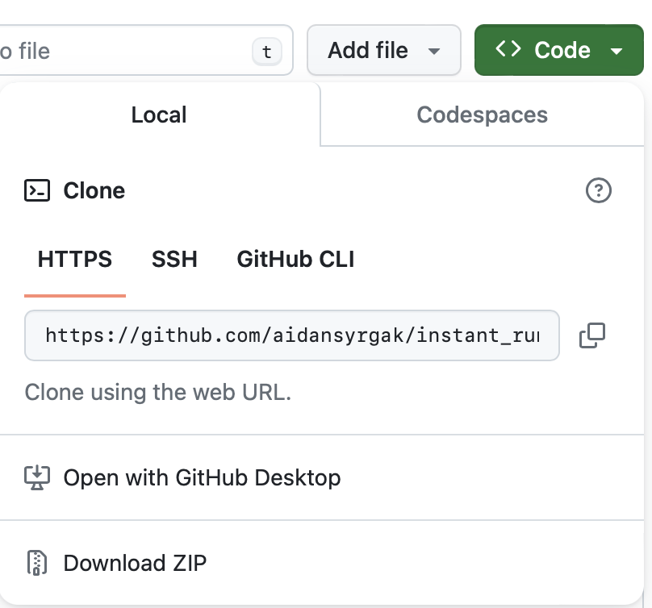

## To run the program:
The program runs in Python, so make sure you have Python installed.
1. Open the project in your desired IDE

2. Open terminal and enter:  
`pip install -r requirements.txt`

3. Go to **main.py** file

4. Modify the path to the CSV file in quotations marks and modify the number of seats.

5. Run **main.py** to see the results

## Downloading

1. On top of the page, click **<> Code** and **Download ZIP**

https://github.com/aidansyrgak/instant_runoff_voting

2. Unzip and open the project in your desired IDE