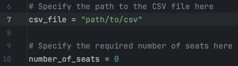

To download:

Open the project in your desired IDE

Open terminal and enter:
    pip install -r requirements.txt

Go to main.py file

Modify the path of the CSV file and modify the number of seats.

Run main.py to see the results